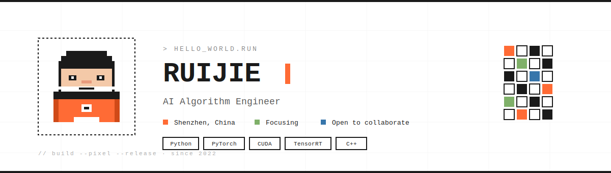

<!-- ▸ Hero Banner -->
<p align="center">
  
</p>

<br/>

## `01` · About

I build computer-vision pipelines that turn video streams into structured signals.
Based in Shenzhen, focused on deep-learning deployment and real-time inference.

> *Constructing elegant hierarchies for maximum code reuse and extensibility.*

<br/>

## `02` · Featured Project

<a href="https://github.com/RuijieSpace/Deepstream_Python_Stack">
  
</a>

A Python stack for NVIDIA DeepStream — video analytics pipelines with GPU-accelerated inference.

<br/>

## `03` · Currently Learning

```
[■■■■■■■■□□]  LLM inference optimization
[■■■■■□□□□□]  Edge deployment on Jetson
[■■■□□□□□□□]  Multi-modal video understanding
```

<br/>

## `04` · Connect

<p>
  <a href="https://github.com/RuijieSpace">
    
  </a>
  &nbsp;
  <a href="https://panxiaolan.blog.csdn.net/">
    
  </a>
  &nbsp;
  <a href="https://space.bilibili.com/496045533/">
    
  </a>
</p>

<br/>
<br/>

<p align="center">
  
  
</p>

<br/>

<p align="center">
  <sub>
    <code>//</code> &nbsp; built with pixels, deployed with care &nbsp; <code>//</code>
  </sub>
</p>
