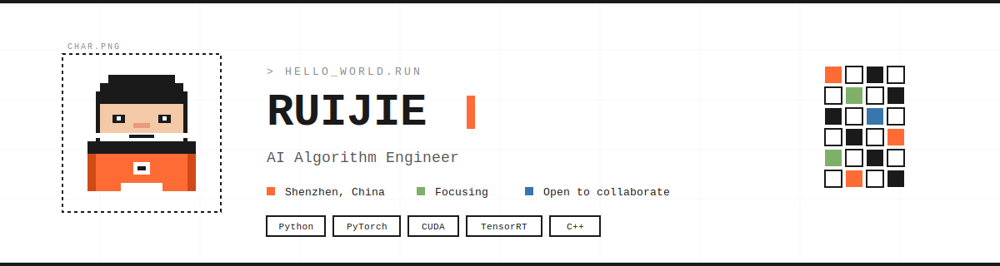
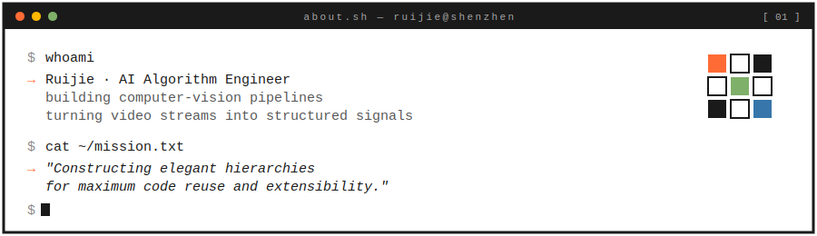
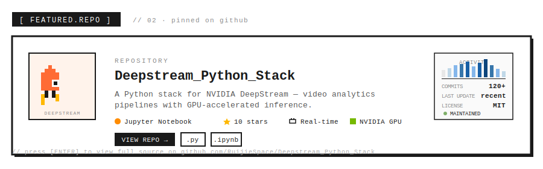
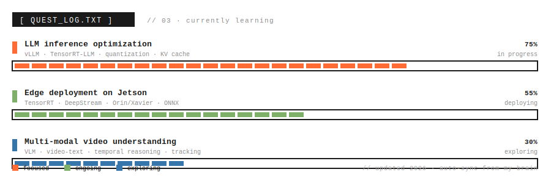
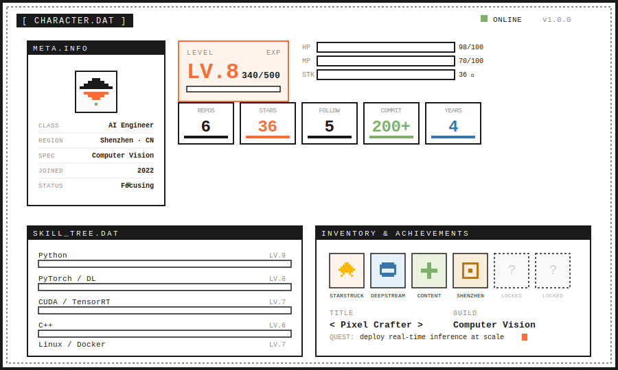
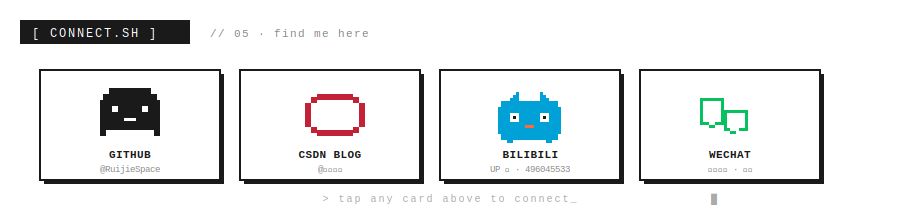

<!-- ────────────────────────────────
     Ruijie · GitHub Profile
     Fully pixel-crafted, SVG-animated
     Last crafted: 2026
──────────────────────────────── -->

  

  

  

  

  

  

 

  <code>//</code>&nbsp;&nbsp;pixel-crafted in Shenzhen, deployed with care&nbsp;&nbsp;<code>//</code>

<!-- ────────────────────────────────
     All section artwork lives in ./assets/
     Edit an SVG to update just that block.
──────────────────────────────── -->
